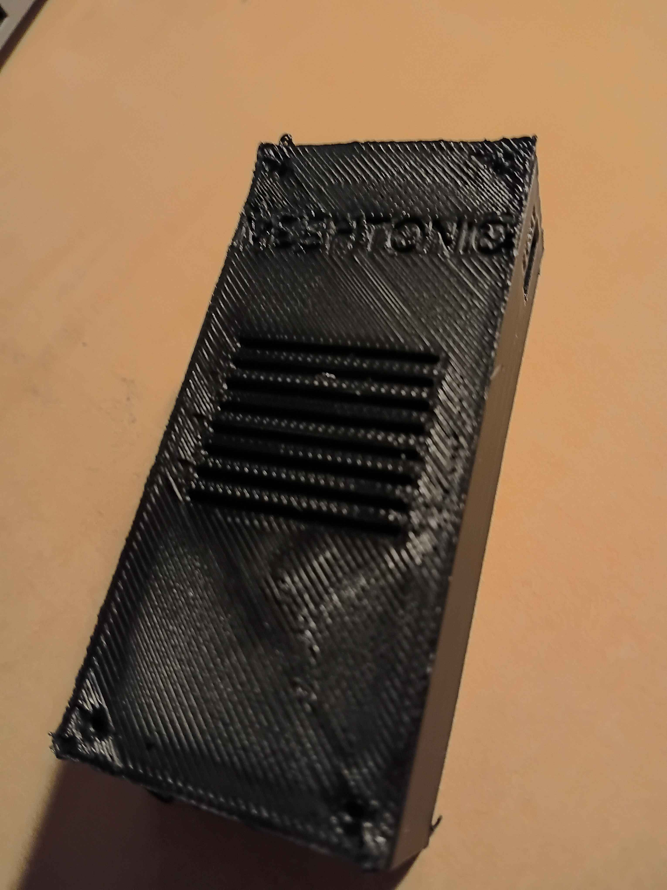
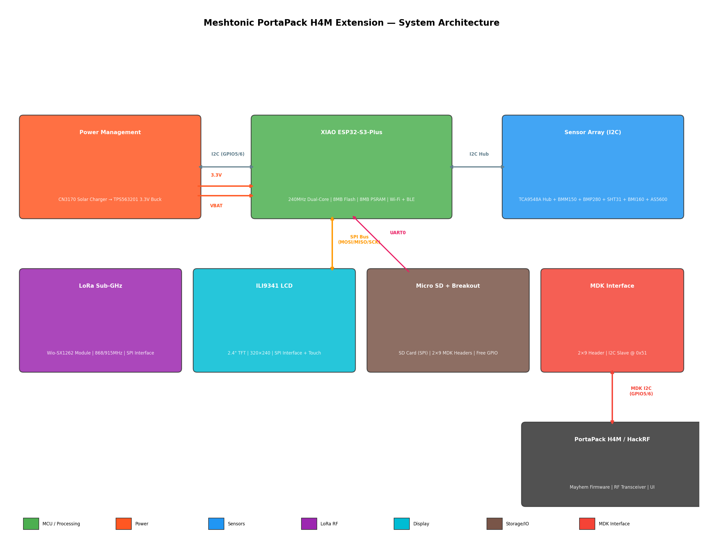
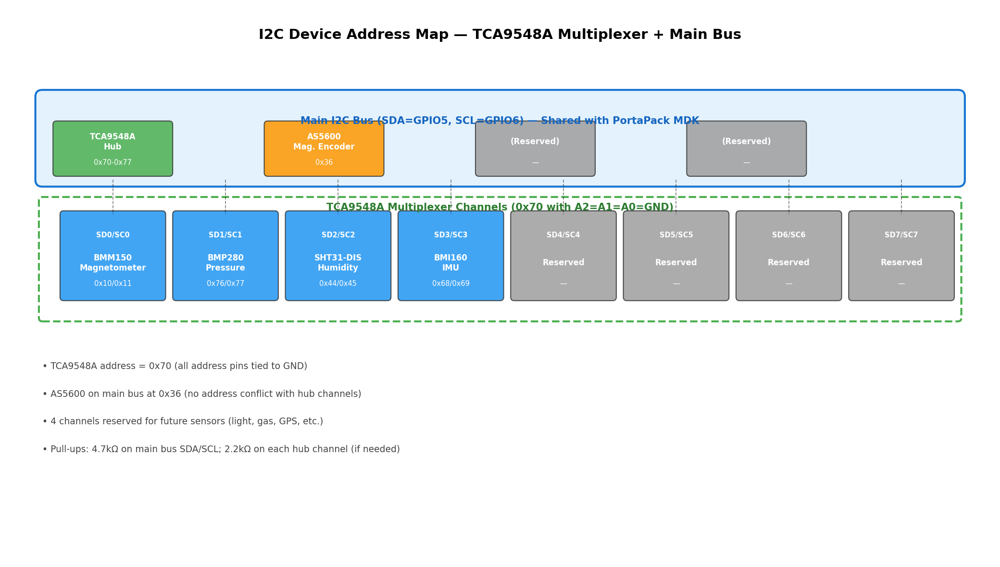
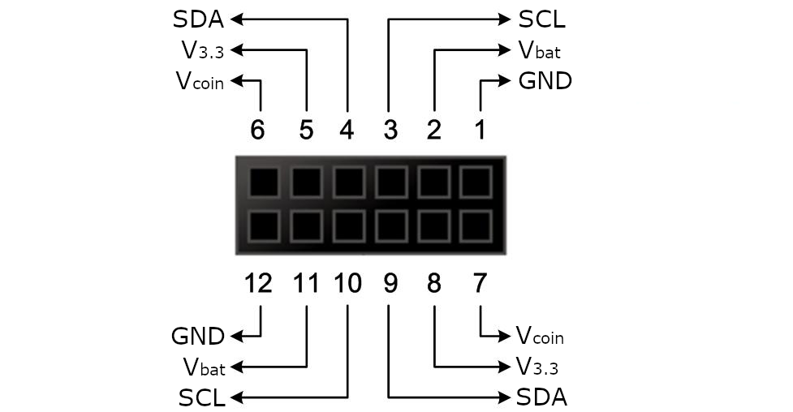
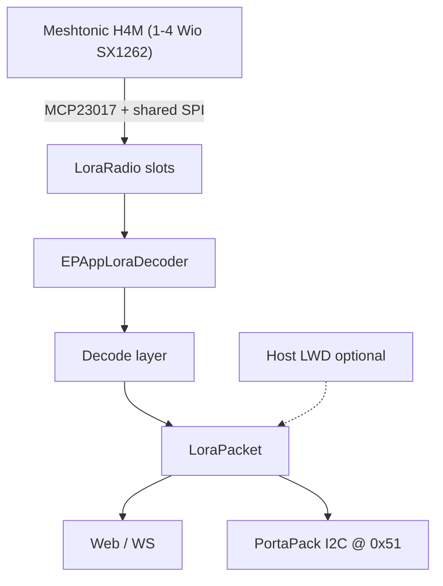

# Meshtonic

**Meshtonic H4M Companion v2** is a custom carrier board and firmware stack for a [Seeed XIAO ESP32-S3 Plus](https://www.seeedstudio.com/Seeed-Studio-XIAO-ESP32S3-Plus-p-6361.html) that docks to a **HackRF + PortaPack H4M (Mayhem)** and can also run as a **standalone Meshtastic** mesh node.

**Repository:** [github.com/Josephrp/meshtonic](https://github.com/Josephrp/meshtonic) (formerly `Meteor-On-Mesh`)

<p align="center">
  
</p>

| Mode | Role |
|------|------|
| **Docked (Mayhem MDK)** | ESP32 is an I2C slave at `0x51` on the PortaPack MDK connector. Exposes GPS, sensors, web UI, and 1–4 LoRa radios to Mayhem; runs the on-device LoRa decoder EPApp. |
| **Standalone (Meshtastic)** | Flash the Meshtastic image instead. Board becomes a LoRa mesh node with GPS, TFT, and muxed sensors. |

The two ESP32 firmwares are **mutually exclusive** — flash one or the other depending on whether you are using the board docked or as a mesh node.

---

## Hardware overview

| Block | Parts |
|-------|--------|
| **MCU** | Seeed XIAO ESP32-S3 Plus (ESP32-S3, 16 MB flash, OPI PSRAM) |
| **LoRa** | Up to **4×** [Wio-SX1262](https://www.seeedstudio.com/) shields — shared SPI, per-radio CS on native GPIO, BUSY/DIO1/RST via **MCP23017** `@ 0x20` |
| **Sensors** | **TCA9548A** `@ 0x70` mux: BMM150, BMP280, SHT3x, BMI160; **AS5600** on the main I2C bus |
| **GPS** | NEO-6M (UART1) |
| **Display / storage** | ILI9341 240×320 SPI TFT, microSD |
| **Host link** | PortaPack H4M / MDK-compatible connector (I2C slave + power) |
| **Power** | USB / solar → **CN3170** LiPo charge → **TPS63020** 3.3 V buck-boost |

Canonical pin map (silicon GPIO numbers for the XIAO Plus — `Dn ≠ GPIOn` above D5):

- Shared SPI: MOSI / MISO / SCK = GPIO 38 / 39 / 40  
- I2C: SDA / SCL = GPIO 5 / 6  
- WIO1–4 CS: GPIO 3 / 4 / 10 / 13  
- MCP INTA: GPIO 44 · WIO1 DIO1: GPIO 12  
- Full table: [`firmwares/pin_mapping.cpp`](firmwares/pin_mapping.cpp) and the variant [`PIN_AUDIT.md`](firmwares/meshtastic/variants/esp32s3/diy/meshtonic_h4m_wio1/PIN_AUDIT.md)

<p align="center">
  
  <br />
  
  
</p>

Architecture notes for the docked LoRa path (MCP ISR → radio manager → decoder → web / PortaPack) live in [`static/diagrams.md`](static/diagrams.md).

### Enclosure

3D-printable case STLs (65 × 140 mm footprint):

- [`case/enclosure_base_65x140x32.stl`](case/enclosure_base_65x140x32.stl)
- [`case/enclosure_lid_65x140.stl`](case/enclosure_lid_65x140.stl)

---

## Software stack

| Tree | Upstream | Meshtonic role |
|------|----------|----------------|
| [`firmwares/meshtastic/`](firmwares/meshtastic/) | [Meshtastic firmware](https://github.com/meshtastic/firmware) (GPL-3.0) | Custom board env `meshtonic-h4m-wio1` — WIO1-first standalone mesh |
| [`firmwares/mayhem-mdk/`](firmwares/mayhem-mdk/) | [ESP32-Portapack / Mayhem MDK](https://github.com/htotoo/ESP32-Portapack) (HTL) | Docked companion: `HW_VARIANT_MESHTONIC_H4M`, MCP + TCA drivers, multi-slot SX1262 manager, LoRa decoder EPApp, optional host LWD bridge |
| [`firmwares/mayhem-firmware/`](firmwares/mayhem-firmware/) | [PortaPack Mayhem](https://github.com/portapack-mayhem/mayhem-firmware) (GPL-3.0) | Vendored Mayhem tree + PortaPack UI app under `firmware/standalone/meshtonic_lora/` |

Shared first-party pin constants: [`firmwares/pin_mapping.cpp`](firmwares/pin_mapping.cpp).

### Docked LoRa decoder (MDK)

When Mayhem MDK is flashed with the Meshtonic H4M profile:

1. ESP32 auto-runs the LoRa Decoder EPApp.
2. Up to four Wio-SX1262 modules listen in parallel (narrowband).
3. Optional HackRF wideband path: PortaPack sends short IQ bursts over I2C (`0xA012`); ESP DSP + decode run on-device.
4. Status and packets paint on the PortaPack LCD (Apps over I2C) and/or the ESP web UI.

Protocol and backend IDs: [`firmwares/mayhem-mdk/docs/PORTAPACK_LORADEC.md`](firmwares/mayhem-mdk/docs/PORTAPACK_LORADEC.md).



---

## Repository map

```
meshtonic/
├── pcb/                 # KiCad project meshtonic_h4m_v2 (schematics, PCB, BOM, DFM)
├── firmwares/
│   ├── meshtastic/      # Meshtastic + meshtonic_h4m_wio1 variant
│   ├── mayhem-mdk/      # ESP32 Mayhem MDK + Meshtonic H4M profile
│   ├── mayhem-firmware/ # PortaPack Mayhem (+ meshtonic_lora PP app)
│   └── pin_mapping.cpp  # Canonical H4M v2 GPIO / MCP map
├── case/                # Enclosure STLs
├── static/              # Photos, pinout / architecture diagrams, demos
└── README.md
```

Local-only (gitignored) folders such as `refs/` and `backups/` may hold design plans and PCB snapshots on a developer machine; they are not part of the tracked tree.

---

## Getting started

### Prerequisites

| Firmware | Toolchain |
|----------|-----------|
| Meshtastic | [PlatformIO](https://platformio.org/) (CLI or IDE) |
| Mayhem MDK | [ESP-IDF](https://docs.espressif.com/projects/esp-idf/en/latest/esp32s3/) targeting `esp32s3`, or the Docker builders under `firmwares/mayhem-mdk/docker/` |
| PortaPack app | Mayhem firmware build environment (see upstream Mayhem docs) |

Hardware bring-up checklist (I2C scan + radio):

- MCP23017 `@ 0x20`, TCA9548A `@ 0x70`, AS5600 `@ 0x36`
- SX1262 init on populated WIO slot(s)
- GPS NMEA on UART1
- ILI9341 bring-up (standalone Meshtastic)
- LoRa TX/RX with a second Meshtastic node (standalone)

### Flash Meshtastic (standalone)

```bash
cd firmwares/meshtastic
pio run -e meshtonic-h4m-wio1
pio run -e meshtonic-h4m-wio1 -t upload
pio device monitor -b 115200
```

- Board definition: [`boards/meshtonic_h4m_wio1.json`](firmwares/meshtastic/boards/meshtonic_h4m_wio1.json)
- Variant docs: [`variants/esp32s3/diy/meshtonic_h4m_wio1/`](firmwares/meshtastic/variants/esp32s3/diy/meshtonic_h4m_wio1/)
- Upload uses esptool @ 921600 with 1200 bps touch / wait-for-port (16 MB flash)
- Current Meshtastic port is **WIO1-first** (one radio). Multi-radio listening is implemented on the MDK side.

### Flash Mayhem MDK (docked companion)

```bash
cd firmwares/mayhem-mdk/Source
idf.py set-target esp32s3
# Select Meshtonic H4M pins: HW_VARIANT_MESHTONIC_H4M in code,
# and/or choose "Meshtonic H4M" in the web pin-config UI after first boot
idf.py build
idf.py -p <PORT> flash monitor
```

Docker alternative:

```bash
cd firmwares/mayhem-mdk/docker
# see build.ps1 / build-in-container.sh / docker-compose.yml
```

Pin preset for Meshtonic H4M: GPS RX = GPIO 7, shared I2C master+slave on GPIO 5/6 (`HW_VARIANT_MESHTONIC_H4M` in [`pinconfig.h`](firmwares/mayhem-mdk/Source/main/pinconfig.h)).

Optional host-side LoRa wideband decoder / bridge tooling: [`firmwares/mayhem-mdk/lora-wideband-decoder/`](firmwares/mayhem-mdk/lora-wideband-decoder/).

### PortaPack “Meshtonic LoRa” app

PortaPack-side UI that talks to the ESP over Apps-over-I2C lives in:

- [`firmwares/mayhem-firmware/firmware/standalone/meshtonic_lora/`](firmwares/mayhem-firmware/firmware/standalone/meshtonic_lora/)
- Reference / example: [`firmwares/mayhem-mdk/Source/extapps/meshtonic_lora_ui_example.cpp`](firmwares/mayhem-mdk/Source/extapps/meshtonic_lora_ui_example.cpp)

Build and install that app with your usual Mayhem standalone-app workflow, then launch it from the PortaPack App Manager (or rely on Meshtonic H4M auto-start of the ESP decoder).

---

## PCB and manufacturing

KiCad 8 project: **`pcb/meshtonic_h4m_v2`**

| Sheet | Contents |
|-------|----------|
| `meshtonic_h4m_v2.kicad_sch` | Root |
| `Power` | CN3170 charge, TPS63020 3.3 V, battery / solar |
| `Xiao_Core` | XIAO ESP32-S3 Plus |
| `LoRa` | WIO1–4 sockets, MCP23017 radio GPIO |
| `Sensors` | TCA9548A + environmental / IMU / mag |
| `Periferals` | TFT, microSD, GPS, Grove, misc |
| `H4M_Connector` / `MDK_Interface` | PortaPack dock |
| `Breakout_GPIO` | Expansion |

Also: `meshtonic_i2c-hub.kicad_*` for the I2C hub side project.

### BOM / fab

| Artifact | Purpose |
|----------|---------|
| [`pcb/meshtonic_h4m_v2.csv`](pcb/meshtonic_h4m_v2.csv) | Seeed Fusion–oriented PCBA BOM |
| [`pcb/meshtonic_h4m_v2_excluded_from_pcba.csv`](pcb/meshtonic_h4m_v2_excluded_from_pcba.csv) | Hand-fit / DNP (WIO sockets, display, test points, …) |
| [`pcb/_gen_seeed_bom.py`](pcb/_gen_seeed_bom.py) | Regenerates the Seeed BOM + exclusion list |
| [`pcb/dfm/`](pcb/dfm/) | Gerbers, drills, fab zip |

**Hand-fit after PCBA:** Wio-SX1262 modules (and their hybrid SMD+TH landings), display module, and any DNP connectors listed in the exclusion CSV.

Regenerate the Fusion BOM:

```bash
python pcb/_gen_seeed_bom.py
```

---

## Status

This is an active hardware + firmware bring-up project.

- PCB: Meshtonic H4M Companion **v2** (iterating layout / DFM)
- Meshtastic: custom `meshtonic-h4m-wio1` env — single-radio focus
- Mayhem MDK: Meshtonic H4M board profile, multi-radio LoRa decoder path in development
- PortaPack UI app and host LWD bridge: present; expect ongoing protocol/UI work

Demo media: [`static/`](static/) (photos + short videos).

---

## Licenses

This is a **multi-license** monorepo. The root [`LICENSE`](LICENSE) is the index; full texts live under [`LICENSES/`](LICENSES/).

| Component | License |
|-----------|---------|
| `pcb/`, `case/`, `firmwares/pin_mapping.cpp` | [CERN-OHL-P-2.0](LICENSES/CERN-OHL-P-2.0.txt) |
| `README.md`, `static/` | [CC-BY-4.0](LICENSES/CC-BY-4.0.txt) |
| `firmwares/meshtastic/` | [GPL-3.0](firmwares/meshtastic/LICENSE) |
| `firmwares/mayhem-firmware/` | GPL-3.0 (see tree) |
| `firmwares/mayhem-mdk/` | Custom **HTL** — attribution, contribute improvements back, **no commercial use** ([`LICENSE`](firmwares/mayhem-mdk/LICENSE)) |
| `firmwares/mayhem-mdk/lora-wideband-decoder/` | See that subtree’s `LICENSE` |
| `pcb/libs/` | Upstream library licenses (unchanged) |

Meshtonic board support added inside a firmware tree follows that tree’s license unless a file says otherwise. Upstream copyrights remain with their respective authors.

---

## Links

- [This repository](https://github.com/Josephrp/meshtonic)
- [Meshtastic](https://meshtastic.org) · [firmware](https://github.com/meshtastic/firmware)
- [PortaPack Mayhem](https://github.com/portapack-mayhem/mayhem-firmware)
- [ESP32-Portapack / Mayhem MDK](https://github.com/htotoo/ESP32-Portapack) · [wiki](https://github.com/htotoo/ESP32-Portapack/wiki)
- [Seeed XIAO ESP32-S3 Plus](https://www.seeedstudio.com/Seeed-Studio-XIAO-ESP32S3-Plus-p-6361.html)
- In-repo diagrams: [`static/diagrams.md`](static/diagrams.md) · LoRa over I2C: [`docs/PORTAPACK_LORADEC.md`](firmwares/mayhem-mdk/docs/PORTAPACK_LORADEC.md)
