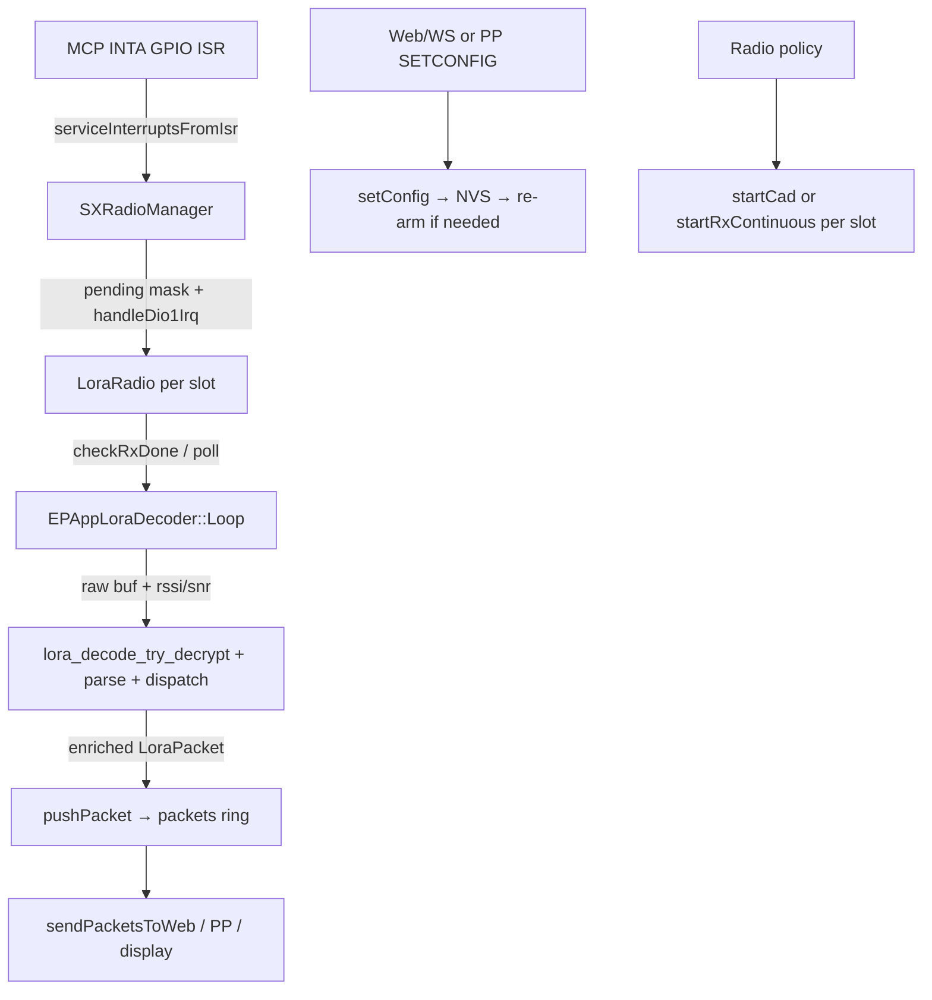
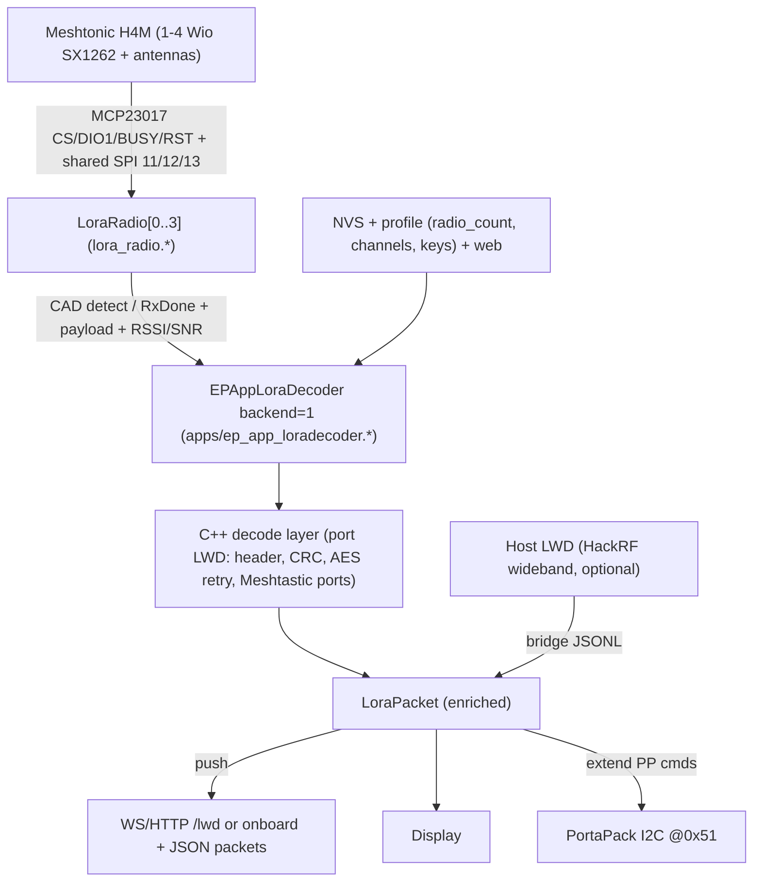

#### Architecture Overview (data flow for backend=1)

```mermaid
flowchart TD
    A[MCP INTA GPIO ISR] -->|serviceInterruptsFromIsr| B[SXRadioManager]
    B -->|pending mask + handleDio1Irq| C[LoraRadio per slot]
    C -->|checkRxDone / poll| D[EPAppLoraDecoder::Loop]
    D -->|raw buf + rssi/snr| E[lora_decode_try_decrypt + parse + dispatch]
    E -->|enriched LoraPacket| F[pushPacket → packets ring]
    F --> G[sendPacketsToWeb / PP / display]
    H[Web/WS or PP SETCONFIG] --> I[setConfig → NVS → re-arm if needed]
    J[Radio policy] --> K[startCad or startRxContinuous per slot]
```

```mermaid
flowchart TD
  Board["Meshtonic H4M (1-4 Wio SX1262 + antennas)"] -->|MCP23017 CS/DIO1/BUSY/RST + shared SPI 11/12/13| LoraRadios["LoraRadio[0..3] (lora_radio.*)"]
  LoraRadios -->|CAD detect / RxDone + payload + RSSI/SNR| EPApp["EPAppLoraDecoder backend=1 (apps/ep_app_loradecoder.*)"]
  EPApp --> DecodeLayer["C++ decode layer (port LWD: header, CRC, AES retry, Meshtastic ports)"]
  DecodeLayer --> LoraPacket["LoraPacket (enriched)"]
  LoraPacket -->|push| Web["WS/HTTP /lwd or onboard + JSON packets"]
  LoraPacket --> Display
  LoraPacket -->|extend PP cmds| PP["PortaPack I2C @0x51"]
  HostLWD["Host LWD (HackRF wideband, optional)"] -->|bridge JSONL| LoraPacket
  Config["NVS + profile (radio_count, channels, keys) + web"] --> EPApp
```
